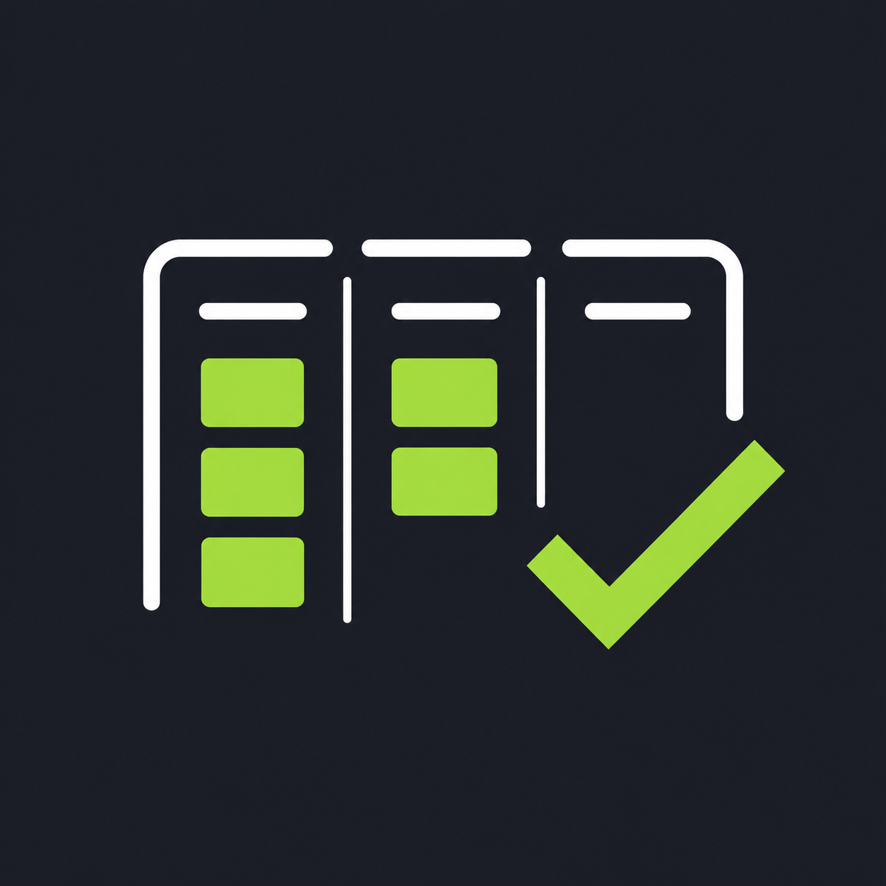

<h1 align="center">
  <br/>
  ToDoKanban
</h1>

<p align="center">
  <strong>Transform your code comments into a fully interactive, visual Kanban board inside VS Code.</strong>
</p>

<p align="center">
  <a href="https://marketplace.visualstudio.com/items?itemName=hartvig-solutions.todokanban"></a>
  <a href="https://github.com/Hartvig-solutions/todokanban/blob/main/LICENSE"></a>
</p>

---

**ToDoKanban** is a powerful productivity extension for Visual Studio Code that bridges the gap between your source code and your project management. 

Instead of searching through your files for `// TODO:` or `// FIXME:`, ToDoKanban automatically scans your workspace and organizes these comments into an interactive, visual Kanban board.

## ✨ Features

- 🎯 **Visual Kanban Board:** A beautifully integrated Webview that displays your workspace TODOs as draggable cards within a native-feeling Kanban board.
- ⚡ **Magic Source Updates:** When you drag a card from one column to another (e.g., from *To Do* to *In Progress*), the extension automatically updates the underlying comment in your actual source code!
- 🗂 **Smart Sidebar Integration:** A dedicated Tree View in your Activity Bar. See your tasks grouped by status without opening the full board.
- 🔄 **Real-Time Auto-Sync:** The board and sidebar automatically stay in sync. Save a file, and the changes are instantly reflected in your board.
- 📍 **One-Click Navigation:** Click any card in the Kanban board or task in the sidebar to jump straight to that exact line in your code.
- ⚙️ **Fully Configurable:** Tailor the columns and keywords to match your team's workflow.

## 🚀 How to Use

1. **Install** the extension from the VS Code Marketplace.
2. Open any workspace and add comments matching your configured keywords, for example: 
   ```typescript
   // TODO: Refactor this database query
   // IN PROGRESS: Implementing the new authentication flow
   ```
3. Open the **ToDo Kanban** view from your Activity Bar (the checklist icon).
4. Click the **Open Kanban Board** button at the top of the sidebar.
5. **Drag and drop** tasks across columns and watch your source code magically update itself!

## ⚙️ Configuration

ToDoKanban is highly flexible. You can customize the Kanban columns and the exact keywords they listen for by modifying your `settings.json`.

* `todokanban.columns`: Configure the columns and their associated keywords.

**Default Settings:**
```json
"todokanban.columns": [
    { "name": "To Do", "keywords": ["TODO", "FIXME"] },
    { "name": "In Progress", "keywords": ["IN PROGRESS", "DOING"] },
    { "name": "Done", "keywords": ["DONE"] }
]
```

## 🐛 Known Issues

- The auto-replace Drag-and-Drop feature currently relies on standard single-line comments (e.g., `// TODO:` or `# TODO:`). Native support for modifying multi-line block comments (`/* ... */`) is planned for a future update.

## 📝 Release Notes

Please refer to the [CHANGELOG.md](CHANGELOG.md) for detailed release notes and version history.
